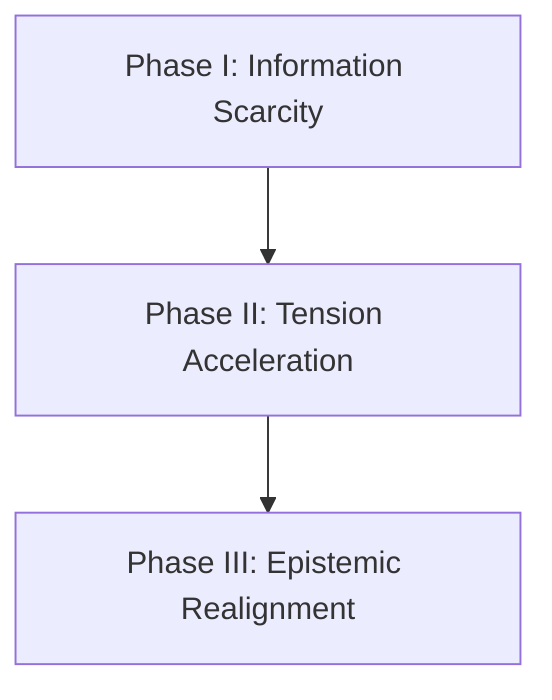

# Theoretical Narrative Structure and Information Theory Guidebook

This document details the scientific and theoretical frameworks governing narrative structure, information distribution, progression pacing, and reader-led cognitive assembly in interactive mediums.

## 1. Information Entropy and Narrative Anchoring

Narrative progression is the controlled dissipation of information entropy. At the beginning of a system (Chapter 1), information entropy is high, meaning the reader faces a wide spectrum of possible states. 

### The Anchor Hypothesis
To prevent cognitive overload or detachment, the system must deploy semantic anchors.
- **Mundane Anchoring:** Anchors must appear trivial and integrated into the default environment (noise). If an anchor stands out too sharply, its salience increases, causing the reader to identify it as a narrative device, which destroys the illusion of reality.
- **Cognitive Reconstruction:** The reader is an active processing unit. A narrative does not deliver meaning; it delivers raw data points. Meaning is generated when the reader connects these data points using their own cognitive schemas.

## 2. Pacing Framework: The Three Phases of Epistemic Progression

A multi-chapter narrative structure moves through three distinct operational phases:

### Phase I: Information Scarcity and Local Anchors
- **Objective:** Establish the status quo and seed latent anomalies.
- **Constraints:** The local environment must seem functional and self-contained. Discrepancies must be explainable by natural system errors (such as smudges, tuning errors, or misplacements).
- **Tension:** Low but persistent. The conflict is local, mundane, and relatable (such as academic or social friction).

### Phase II: Systemic Discrepancy and Tension Acceleration
- **Objective:** Reveal that the status quo is incomplete or systematically flawed.
- **Constraints:** Local explanation mechanisms begin to fail. The discrepancies grow in frequency and scale, colliding with the mechanical gameplay loops.
- **Tension:** Accelerating. The local conflicts escalate as the reader realizes the boundaries of the system are unstable.

### Phase III: Resolution and Epistemic Realignment
- **Objective:** Integrate all previous clues into a single, cohesive structural paradigm.
- **Constraints:** The final clue must not be an explanation. It must act as the missing operator in an equation, allowing the reader to instantly re-evaluate every previous clue under a new framework.
- **Tension:** Culmination followed by structural closure. The mystery resolves not through external exposition, but through internal realization.

## 3. The Science of Seeded Clues (Semantic Anchors)

The effectiveness of a narrative mystery is determined by the relationship between three variables: **Salience**, **Density**, and **Deductive Utility**.

| Variable | Definition | Pacing Target |
| :--- | :--- | :--- |
| **Salience** | How easily a clue is noticed by the reader. | Minimum in early phases; scaling upward. |
| **Density** | The volume of clues distributed in a single space. | Low, to avoid cluttering cognitive capacity. |
| **Deductive Utility** | The logical weight a clue holds in solving the puzzle. | Latent initially; active only when grouped. |

### The Triviality Constraint
A clue must have high deductive utility but low immediate salience. The player should register the detail as a standard part of the environment, storing it in working memory without immediately processing it. The disclosure of a second, complementary clue later increases the salience of the first, forcing the player to retrieve and integrate it.

## 4. Ludonarrative Symbiosis

In interactive systems, story progression must align with mechanical progression.
- **Mechanical Action as Narrative Choice:** When a player performs a gameplay mechanic (such as deck construction, stat modification, or dimension shifting), they are executing a narrative choice.
- **Systemic Friction:** Narrative tension is reinforced when the mechanical cost of survival (such as using resources or shifting states) directly corresponds to the thematic decay of the narrative environment. The player's mechanical optimization of the game should drive the thematic progression of the story.
