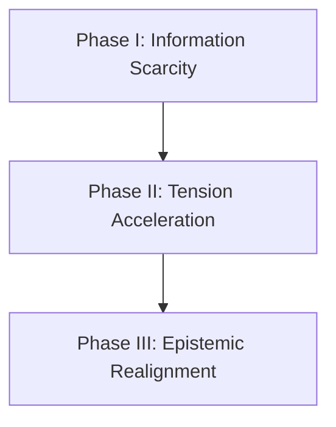

# Theoretical Narrative Structure and Information Theory Guidebook

This document details the scientific and theoretical frameworks governing narrative structure, information distribution, progression pacing, and reader-led cognitive assembly in interactive mediums. It serves as an abstract guidebook on the mechanics of storytelling, free of specific narrative content.

## 1. Information Entropy and Narrative Anchoring

Narrative progression is the controlled dissipation of information entropy. At the beginning of a system (Chapter 1), information entropy is high, meaning the reader faces a wide spectrum of possible states.

### The Anchor Hypothesis
To prevent cognitive overload or detachment, the system must deploy semantic anchors.
- **Mundane Anchoring:** Anchors must appear trivial and integrated into the default environment (noise). If an anchor stands out too sharply, its salience increases, causing the reader to identify it as a narrative device, which destroys the illusion of reality.
- **Cognitive Reconstruction:** The reader is an active processing unit. A narrative does not deliver meaning; it delivers raw data points. Meaning is generated when the reader connects these data points using their own cognitive schemas.

## 2. Pacing Framework: The Three Phases of Epistemic Progression

A multi-chapter narrative structure moves through three distinct operational phases:

### Phase I: Information Scarcity and Local Anchors
- **Objective:** Establish the status quo and seed latent anomalies.
- **Constraints:** The local environment must seem functional and self-contained. Discrepancies must be explainable by natural system errors (such as smudges, calculation errors, or physical misplacements).
- **Tension:** Low but persistent. The conflict is local, mundane, and grounded.

### Phase II: Systemic Discrepancy and Tension Acceleration
- **Objective:** Reveal that the status quo is incomplete or systematically flawed.
- **Constraints:** Local explanation mechanisms begin to fail. The discrepancies grow in frequency and scale, colliding with the mechanical loops of the system.
- **Tension:** Accelerating. The local conflicts escalate as the reader realizes the boundaries of the system are unstable.

### Phase III: Resolution and Epistemic Realignment
- **Objective:** Integrate all previous clues into a single, cohesive structural paradigm.
- **Constraints:** The final clue must not be an explanation. It must act as the missing operator in an equation, allowing the reader to instantly re-evaluate every previous clue under a new framework.
- **Tension:** Culmination followed by structural closure. The mystery resolves not through external exposition, but through internal realization.

## 3. The Science of Seeded Clues (Semantic Anchors)

The effectiveness of a narrative mystery is determined by the relationship between three variables: **Salience**, **Density**, and **Deductive Utility**.

| Variable | Definition | Pacing Target |
| :--- | :--- | :--- |
| **Salience** | How easily a clue is noticed by the reader. | Minimum in early phases; scaling upward. |
| **Density** | The volume of clues distributed in a single space. | Low, to avoid cluttering cognitive capacity. |
| **Deductive Utility** | The logical weight a clue holds in solving the puzzle. | Latent initially; active only when grouped. |

### The Triviality Constraint
A clue must have high deductive utility but low immediate salience. The player should register the detail as a standard part of the environment, storing it in working memory without immediately processing it. The disclosure of a second, complementary clue later increases the salience of the first, forcing the player to retrieve and integrate it.

## 4. Ludonarrative Symbiosis

In interactive systems, story progression must align with mechanical progression.
- **Mechanical Action as Narrative Choice:** When a player performs a gameplay mechanic (such as resource management, state modification, or tactical shifts), they are executing a narrative choice.
- **Systemic Friction:** Narrative tension is reinforced when the mechanical cost of survival (such as using resources or shifting states) directly corresponds to the thematic decay of the narrative environment. The player's mechanical optimization of the game should drive the thematic progression of the story.

## 5. Cognitive Psychology and Epistemic Science in Narrative Design

The design of a mystery-driven psychological narrative relies on established cognitive mechanisms. Rather than delivering explicit exposition, the narrative functions as a stimulus that triggers the reader's default neurological processing systems.

### Bartlett's Schema Theory and Reconstructive Memory
Human memory is reconstructive rather than reproductive. When recalling past events, the brain retrieves raw fragments and fits them into pre-existing schemas (cognitive frameworks of expectations).
- **Schematic Congruence:** The brain naturally forces anomalous details to fit comfortable schemas to avoid psychological friction. For example, an anomalous environmental gap is unconsciously explained away as a commonplace occurrence.
- **Schema Disruption:** The narrative pacing must gradually introduce anomalies that cannot be resolved by existing schemas. When multiple contradictory details accumulate, the reader's schema collapses, forcing them to reconstruct a new mental framework to explain the anomalies.

### Festinger's Cognitive Dissonance in Ludic Shifts
When a subject holds two contradictory beliefs, they experience cognitive dissonance (psychological discomfort). To eliminate this discomfort, the subject constructs defense mechanisms or shifts their perspective.
- **Escapism as Cognitive Defense:** The subject builds an alternate, internally consistent cognitive framework as a shield against environmental stressors.
- **Ludic State Alteration:** Alternating states represent switching between primary and secondary cognitive systems. Moving to the secondary system resolves immediate mechanical stress, but forces a confrontation with the primary anomalies upon return.

### Loewenstein's Information-Gap and the Zeigarnik Effect
Curiosity is an epistemic feeling of deprivation that arises when there is a cognitive gap between current knowledge and desired knowledge.
- **Information-Gap Management:** The pacing must keep the information gap narrow but expanding. If the gap is too wide, the player experiences frustration; if the gap is closed too early (spoilers), the player experiences boredom.
- **Zeigarnik Effect:** The brain retains incomplete task or information loops in working memory much longer than completed ones. By delivering clues as unresolved, trivial details (unresolved loops), the narrative maintains a constant, low-level cognitive tension.

### Gestalt Law of Closure in Narrative Assembly
The human mind possesses a natural tendency to perceive incomplete configurations as complete wholes.
- **Semantic White Space:** By leaving intentional gaps in dialogue, history, and naming, the narrative invites the reader to fill in the missing segments.
- **Deductive Closure:** The resolution is achieved when the reader connects the fragments to achieve closure independently. The emotional impact is directly proportional to the cognitive effort required to resolve the pattern.

### Shklovsky's Defamiliarization (Ostranenie)
In cognitive processing, familiar actions and environments become automatized, meaning they are experienced unconsciously.
- **Perception Interruption:** Narrative defamiliarization strips objects of their automatic meaning. By converting a standard, low-salience environmental asset into a functional tool, the system de-automatizes the player's perception.
- **Aesthetic Attention:** Defamiliarization increases the difficulty and duration of perception. This cognitive resistance forces the reader to pay closer attention to the textures and structures of the environment, making them more likely to store trivial clues in working memory.

### Eco's Open Work and Iser's Narrative Gaps (Lücken)
A text is not a closed package containing a static message, but a field of interpretive possibilities.
- **Lücken (Semantic Gaps):** Wolfgang Iser argues that the primary engine of reader engagement is the presence of gaps or blanks in the text. These gaps are not bugs or omissions; they are functional voids.
- **Ideation:** When the text refuses to state a relationship or event, the reader's mind must bridge the gap. This active bridge-building (ideation) makes the reader the co-creator of the story structure, grounding the narrative in the reader's own psychological associations.

### Tulving's Encoding Specificity and Retrieval Cues
The retrieval of a memory depends on the structural compatibility between the retrieval cue and the environment where the memory was originally encoded.
- **Context-Dependent Retrieval:** Trivial anchors (such as specific sounds or symbols) are encoded within a specific environmental context. 
- **Epistemic Collision:** When the state shifts, these anchors reappear in the new context as retrieval cues, triggering involuntary memory recall and highlighting structural gaps between the two states.

### Neurocognitive Compartmentalization and Dissociative Amnesia
Under psychological stress, the brain protects its cognitive integrity by establishing functional boundaries between memory networks.
- **State-Dependent Compartmentalization:** Traumatic memories or stressors are locked inside a specific neural state, isolated from everyday consciousness. 
- **Mechanical State Partitioning:** The separation of states acts as a mechanical representation of this compartmentalization. By partitioning the interaction environment, the system replicates the cognitive boundaries of memory isolation, letting the player experience the structural walls of the mental model.

## 6. Advanced Structural Semiotics and Narrative Transport

To systematically manage the reader's progress and immersion, narrative design integrates frameworks from structural linguistics, cognitive loading, and temporal structuring.

### Barthes' Hermeneutic Code (The Delay of Enigmas)
Roland Barthes identified five codes that structure text. The Hermeneutic Code governs the posing, delaying, and resolving of enigmas.
- **Enigma Formulation:** Seeding a question without an immediate response.
- **Suspension of Answers:** Deliberate delays using red herrings, partial answers, or shifting focus to separate systems.
- **Hermeneutic Pacing:** Controlling the speed of disclosure to match the player's progression. The narrative remains structurally stable as long as the rate of enigma generation is balanced with the rate of resolution.

### Gerrig and Green's Narrative Transportation Theory
Narrative transportation is the cognitive process where a subject becomes fully absorbed in a narrative world, losing awareness of their physical surroundings.
- **Cognitive Isolation:** High narrative transportation reduces the reader's access to real-world schemas, making them highly receptive to the rules of the virtual environment.
- **Transportation Anchors:** Maintaining transport requires the narrative world to be internally consistent. Anomalies must be introduced as features of the system rather than logical bugs in the presentation.

### Sweller's Cognitive Load Theory in Mystery Pacing
Human working memory is limited in duration and capacity. Pacing must systematically budget the three forms of cognitive load:
- **Intrinsic Load:** The effort required to understand the immediate mechanical rules of the system.
- **Germane Load:** The effort dedicated to processing and constructing narrative schemas (solving the mystery).
- **Extraneous Load:** The effort wasted on unorganized or redundant information.
- **Pacing Rule:** To allow the player to dedicate working memory to germane load (connecting clues), the intrinsic and extraneous loads must be minimized during exploration. Starting with trivial, low-salience details keeps cognitive load low, preventing overload and keeping the deductive process active.

### Genette's Narrative Temporality and Anachrony
Gérard Genette outlined the temporal relationships in narrative, specifically Order, Duration, and Frequency.
- **Anachrony (Discrepancy of Order):** The difference between the chronological story events (fabula) and their presentation order in the narrative (sjuzhet).
- **Selective Ellipsis:** The narrative purposefully omits key temporal spans to create functional blind spots. The reader's cognitive task is to recognize these omissions and reconstruct the missing timeline from the retrospective hints (analepsis) left in the present.

## 7. Psychoanalytic and Post-Structuralist Semiotics

To understand how narrative gaps translate into existential dread and player engagement, interactive design incorporates psychoanalytic structures, communicative double-binds, and conceptual metaphors.

### Lacan's Tripartite Model: The Real, The Symbolic, and The Imaginary
Jacques Lacan structured human experience into three interlocking orders:
- **The Imaginary:** The order of visual perception, ego identification, and fantasy. It is internally consistent, vibrant, and acts as a protective shield. In storytelling, it represents the escapist, fantasy-driven space constructed by the subject.
- **The Symbolic:** The order of language, social rules, laws, and objective systems. It represents the structured, everyday environment where the subject must conform to external expectations.
- **The Real:** The traumatic domain that lies outside language and symbolization. The Real cannot be represented directly; it can only be experienced when the Imaginary or Symbolic structures crack. Narrative tension peaks when elements of the Real erupt through these cracks, disrupting the subject's fantasy.

### Bateson's Double-Bind Theory in Interactive Conflict
Gregory Bateson defined the double-bind as a communicative dilemma where a subject receives contradictory messages, and any choice leads to failure.
- **Systemic Contradiction:** A primary command is countered by a secondary command at a more abstract level, enforced by a penalty.
- **Ludic Double-Bind:** In interactive pacing, a double-bind occurs when the mechanical requirements of survival (such as winning a battle or optimizing stats) require the systematic dismantling of the subject's identity or memory. The player is caught in a loop where mechanical success drives narrative degradation.

### Derrida's Traces and the Deferral of Meaning (Différance)
Jacques Derrida argued that meaning is never fully present in a signifier; it is always deferred along a chain of associations.
- **Différance (Deferral):** Meaning is generated not by static definitions, but by the constant delay of resolution. The narrative remains engaging as long as the ultimate signifier is withheld, keeping the reader moving along the associative chain.
- **The Trace:** An absent signifier leaves a trace of itself in the present. By seeding environments with objects that point to missing functions or names, the narrative establishes an absent presence, forcing the reader to search for the origin of the trace.

### Lakoff and Johnson's Conceptual Metaphors
George Lakoff and Mark Johnson demonstrated that human cognitive systems understand abstract, complex concepts (such as grief, time, or memory decay) through concrete, physical concepts.
- **Mapping:** The narrative maps abstract cognitive domains onto physical mechanics (such as fading light, empty spaces, and smudging graphite).
- **Metaphorical Mechanics:** When the physical mechanics are integrated into player interactions, they function as cognitive shortcuts, letting the player experience the abstract concept of mental decay through physical, interactive actions.

## 8. Ontological Boundaries, Affect, and Aesthetic Dread

To manage player tension and construct psychological horror without relying on explicit threat presentation, interactive narratives implement formal structures that govern perception, world boundaries, and pre-conscious emotional states.

### Freud's The Uncanny (Das Unheimliche)
Sigmund Freud defined the uncanny as the class of the frightening which leads back to what is known of old and long-familiar. It is the psychological experience of an object or situation being simultaneously familiar and foreign.
- **The Familiar Made Strange:** The uncanny is triggered when automated, safe environmental assets are slightly altered, introducing a microscopic deviation from the expected state. 
- **Return of the Repressed:** The discomfort arises because the anomaly reminds the subject of a repressed truth or primitive belief that they have consciously rejected. In narrative structure, the uncanny serves as the primary driver of psychological horror, utilizing the familiar to evoke deep unease.

### McHale's Ontological Metalepsis and Boundary Bleeding
Brian McHale and Gérard Genette defined metalepsis as the violation of narrative levels, where boundaries between distinct diegetic worlds are crossed or blurred.
- **Ontological Shock:** When characters, rules, or assets from a primary narrative level bleed into a secondary, isolated fantasy level, the boundary between the two systems collapses.
- **Epistemological Collapse:** This metalepsis forces the player to re-evaluate the ontological status of both worlds, destroying their sense of security in the primary environment.

### The Kuleshov Effect in Cross-State Association
The Kuleshov Effect is a cognitive phenomenon where viewers derive more meaning from the interaction of two sequential images than from a single image in isolation.
- **Semantic Juxtaposition:** The reader is presented with a mundane object in state A, and then an abstract, heightened counterpart in state B. 
- **Associative Synthesis:** The text does not explain the connection between the two states. The reader's cognitive system automatically synthesizes the relationship, projecting deep symbolic meaning onto the connection and creating a personalized puzzle piece.

### Massumi's Affect Theory and Atmospheric Attunement
Brian Massumi defined affect as a pre-conscious, non-linguistic intensity that passes between bodies and environments. It is distinct from emotion, which is a conscious, captured feeling.
- **Pre-Conscious Tension:** Before any narrative event or dialogue occurs, the environment must be tuned to construct affective tension.
- **Atmospheric Attunement:** By managing low contrast, minimal environmental choice, quiet audio profiles, and restricted movement speed, the system conditions the reader's nervous system. This attunement ensures that subsequent narrative anomalies are received with heightened cognitive salience and aesthetic dread.

## 9. Structural Anthropology, Hermeneutics, and Temporal Pacing

To construct narratives where the reader must synthesize meaning from fragments, the design must leverage binary semiotic structures, dual timelines, and specific pacing operations.

### Levi-Strauss' Mythemes and Binary Oppositions
Claude Levi-Strauss demonstrated that cultural myths and structural narratives are organized around fundamental binary oppositions (such as life vs. death, wakefulness vs. sleep, order vs. chaos).
- **Mediating Signifiers:** The structural tension of these binary oppositions is managed by introducing a third, mediating signifier that shares properties of both poles. 
- **Systemic Resolution:** The narrative pacing relies on the reader's cognitive drive to resolve this binary tension, utilizing the mediator to bridge the gap between the two opposite poles of the narrative world.

### Todorov's Dual Narrative of Investigation
Tzvetan Todorov argued that all mystery-based narratives consist of two distinct stories:
- **The Story of the Past (The Fabula):** The chronological sequence of events that actually occurred (such as the origin of a status quo or a hidden action). This story is absent, invisible, and cannot be directly observed.
- **The Story of the Present (The Sjuzhet):** The process of discovery, where the reader interacts with the remaining traces of the past. The present story exists solely to reconstruct the absent past story. The narrative is successful when the second timeline perfectly map-resolves the first without spelling it out.

### Sternberg's Tripartite Pacing: Curiosity, Suspense, and Surprise
Meir Sternberg defined narrative interest as the interaction of three distinct cognitive forces:
- **Curiosity (Focus on the Past):** The cognitive interest generated by an information gap regarding events that have already occurred. The reader is motivated to find retrospective retrieval cues to fill the gap.
- **Suspense (Focus on the Future):** The anxiety generated by uncertainty regarding upcoming events. The reader has the data but cannot predict the system's next state.
- **Surprise (Focus on the Present):** The cognitive shock that occurs when the actual disclosure of information invalidates the reader's current hypotheses, forcing a retroactive re-evaluation of all previous clues.

### Ricoeur's Hermeneutics of Suspicion and Unreliable Systems
Paul Ricoeur defined the hermeneutics of suspicion as a method of interpretation that reads against the grain to uncover hidden truths, repressions, and displacements.
- **Unreliable Frameworks:** When the primary narrator or environmental system exhibits omissions or functional errors, the reader adopts a stance of suspicion.
- **Subtextual Assembly:** Rather than accepting the surface description, the reader analyzes the omissions (semantic white space) as active indicators of a repressed subtext, constructing the true state of the narrative from what the system actively refuses to say.

## 10. Existential Phenomenology, Conceptual Blending, and Ergodic Systems

To systematically trigger deep cognitive processing and manage narrative tension, designs implement structures from existential phenomenology, conceptual integration, and non-trivial text traversal.

### Sartre's Phenomenology of Absence and Bad Faith
Jean-Paul Sartre demonstrated that nothingness and absence are not merely the absence of matter, but active, negative presences experienced by human consciousness.
- **Phenomenology of Absence:** When a subject expects a specific entity in an environment and encounters its absence, the void is perceived as a concrete, active quality of the space, triggering existential dread.
- **Bad Faith (Mauvaise Foi):** The process of self-deception where a subject adopts a false role or constructs a secondary delusion to escape the burden of reality. In narrative pacing, the tension lies in the structural instability of this bad faith, which inevitably fractures when confronted with physical traces of the absent reality.

### Fauconnier and Turner's Conceptual Blending Theory
Gilles Fauconnier and Mark Turner outlined how the human mind constructs new meaning by projecting selective details from distinct cognitive inputs into a shared mental space (the Blend).
- **Input Spaces:** The mind maintains input space A (mundane, low-salience environment) and input space B (symbolic, high-salience fantasy).
- **Emergent Structure:** The Blend imports specific rules and constraints from both input spaces, generating new emergent behaviors and meanings that do not exist in either input alone. Pacing is driven by the reader's cognitive effort to map the relationships between the inputs and the blend.

### Aarseth's Ergodic Pacing and Apophenic Integration
Espen Aarseth defined ergodic literature as texts where non-trivial effort is required to traverse the path of the text.
- **Apophenia:** The cognitive tendency to perceive meaningful patterns or connections in random, unrelated data.
- **Ergodic Traversal:** In an information-scarce environment, forcing the player to perform active operations (such as choice validation or state switches) triggers apophenia. The reader actively constructs elaborate hypotheses to bridge the sparse clues, increasing their cognitive investment in the narrative resolution.

### Greimas' Actantial Model and Internalized Narrative Roles
Algirdas Julien Greimas organized narrative drive into six actantial roles: Subject, Object, Sender, Receiver, Helper, and Opponent.
- **Actantial Internalization:** Rather than distributing these roles across separate characters, complex psychological narratives internalize them within a single, fractured consciousness.
- **Psychic Conflict:** The Helper (assisting the subject's quest) and the Opponent (obstructing it) are structured as sub-systems of the same mind. The narrative conflict is resolved when the subject recognizes that the obstacle is an internalized projection of their own cognitive defenses.

## 11. Cybernetics, Semiotic Space, and Cognitive Framing

To maintain system stability and direct the reader's decision-making pathway, interactive design implements frameworks from cybernetic control theory, spatial semiotics, and cognitive framing.

### Ashby's Law of Requisite Variety in System Pacing
W. Ross Ashby formulated the law of requisite variety in cybernetics: "Only variety can destroy variety." In control systems, the variety (complexity) of the regulator must match the variety of the system it regulates to maintain stability.
- **Ludic Variety Matching:** In interactive storytelling, the complexity of the narrative response must match the variety of player inputs. If the player's choices outpace the system's capacity to resolve them, the narrative breaks (system instability).
- **Entropy Regulation:** The system regulates variety by restricting choices during exploration and expanding them only inside structured loops. This manages information entropy, keeping the system stable and predictable while maintaining the illusion of player agency.

### Lotman's Semiosphere and Boundary Crossing Theory
Yuri Lotman defined the semiosphere as the bounded semantic space within which meaning-making occurs.
- **The Boundary:** The boundary of the semiosphere is a bilingual translation filter. Elements crossing the boundary from the inside (known space) to the outside (unknown space) are translated, altering their semantic value.
- **Narrative Transgression:** A narrative event is defined structural-systematically as the transgression of a semantic boundary. By crossing the boundary between primary (objective) and secondary (subjective) spaces, the narrative generates meaning through translation errors and mismatched codes.

### Kahneman and Tversky's Framing Effects in Decision Pacing
Daniel Kahneman and Amos Tversky demonstrated that human choices are systematically biased by how options are framed, specifically whether they are presented as potential gains or potential losses (Prospect Theory).
- **Loss Aversion:** Subjects are risk-averse when facing options framed as gains, but risk-seeking when options are framed as losses.
- **Narrative Choice Framing:** The system paces player decisions by framing choices around preservation (gain frame) or recovery (loss frame). This shapes the player's emotional state, driving cognitive tension without introducing explicit threats.

### Propp's Narrative Morphology and Functional Expectation
Vladimir Propp analyzed the structural morphology of narrative quests, identifying 31 fixed functional roles (functions) that dictate progression.
- **Functional Sequence:** The order of functions is structurally constant. Deviation from the sequence creates systemic friction.
- **Functional Subversion:** Interactive systems maintain interest by satisfying the morphological functions mechanically, while subverting them textually. The player performs the standard actions of a quest, but the narrative content associated with those actions is displaced, forcing the reader to resolve the functional mismatch.

## 12. Linguistic Pragmatics and the Rhetoric of Silence

Narrative meaning is not confined to what is said; it is equally generated by what is deliberately not said, how utterances violate communicative norms, and how narrators position themselves relative to the reader.

### Grice's Cooperative Principle and Conversational Implicature
H. Paul Grice established that human communication operates on four maxims: Quantity (say enough, not too much), Quality (say what is true), Relation (be relevant), and Manner (be clear). Speakers assume these maxims are in force even when they are violated.
- **Implicature:** When a speaker appears to violate a maxim (for example, giving an answer that is too brief or beside the point), the listener does not conclude the communication is broken. Instead, they infer that an implicit meaning must exist which restores the coherence of the exchange.
- **Pragmatic Silence:** In narrative terms, a character's conspicuous failure to name a person, place, or event is itself an utterance. The omission triggers an implicature in the reader: the system is choosing not to say this, therefore the absent content carries weight. Every deliberate gap in dialogue is a functional, meaningful act.
- **Scalar Implicature:** Using a weaker term when a stronger one is available (saying "some" instead of "all") implies the stronger case does not hold. Narrative systems exploit scalar implicature by having characters use vague quantifiers and understated descriptors, triggering the reader to infer the more intense, suppressed case.

### Wayne Booth's Rhetoric of Fiction and the Unreliable Narrator
Wayne Booth introduced the concept of the unreliable narrator: a narrator whose account deviates from the true events of the story in ways the reader is expected to detect and correct.
- **The Implied Author:** Behind every narrator stands the implied author, a reconstructed entity whose values and intentions the reader infers from the total structure of the text. The implied author is never identical to the narrator.
- **Narrative Distance:** Booth defined narrative distance as the gap between the narrator's stated perspective and the implied author's actual values. A wide gap signals an unreliable narrator. Narrative design exploits this gap by giving the narrator a coherent internal logic that the reader can follow, while embedding structural contradictions that indicate the narrator's account is incomplete or self-serving.
- **Dramatic Irony:** When the reader holds more information than the narrator, dramatic irony is produced. The narrative design system generates dramatic irony by placing environmental evidence in the text that contradicts the narrator's self-assessment, letting the reader perceive the truth from a higher position than the narrator.

### Jakobson's Poetic Function and the Self-Referential Message
Roman Jakobson defined six functions of communication. The Poetic Function is when the message directs attention to its own formal structure.
- **Formal Self-Reference:** Repeated syntactic patterns, recurring sounds, or consistent structural motifs draw attention to the text as a constructed object, disrupting the transparency of the narrative medium.
- **Defamiliarizing Form:** When formal patterns are broken or distorted at key narrative moments, the disruption signals the reader that the underlying system is malfunctioning. The breakdown in the text's form mirrors a breakdown in the narrative's internal logic.

## 13. Perceptual Psychology and Interactive Affordance

The design of interactive environments determines which objects the player perceives as meaningful and which fade into ambient noise. Theories of perceptual ecology provide a formal model for this process.

### Gibson's Affordance Theory and Ecological Perception
James J. Gibson defined affordances as the action-possibilities that an environment offers a perceiving agent. Affordances are relational: they exist between the properties of an object and the capabilities of the perceiver.
- **Direct Perception:** Gibson argued that perception is direct, not mediated by mental representations. The perceiver extracts information about affordances directly from the invariant structure of the optic array. Objects are perceived primarily in terms of what they allow the subject to do.
- **Narrative Affordances:** In interactive design, every interactable object carries a dual affordance: a surface affordance (the action the object supports in its immediate functional context) and a narrative affordance (the interpretive action the object supports in the wider story context). Low-salience semantic anchors exploit the gap between these two affordance layers. The surface affordance is salient and immediately understood; the narrative affordance is latent and only activated later.
- **Resonant Objects:** When an object's surface affordance is fully exhausted in the immediate context, but its narrative affordance is not yet activated, the object becomes a resonant object. It stores latent meaning that the reader does not yet have a framework to process. The accumulation of resonant objects builds the reader's sense of unresolved tension.

### Merleau-Ponty's Phenomenology of the Body and Embodied Cognition
Maurice Merleau-Ponty argued that perception is fundamentally embodied; the body is the primary site of knowing, not the abstract mind.
- **Motor Intentionality:** The body reaches toward objects not as a mechanical response, but as a pre-reflective orientation toward the world. Interactive mechanics exploit motor intentionality by creating habitual action loops. Once a mechanical routine is habituated, disrupting it produces a strong, pre-reflective sense of wrongness.
- **Flesh of the World:** Merleau-Ponty argued that the perceiver and the perceived share the same ontological substance. In interactive design, this phenomenological intimacy is replicated when the player's physical inputs are directly mapped to the character's perceptual world, blurring the boundary between player-body and character-body and deepening immersion.

## 14. Music Cognition and Temporal Expectation

Music provides a rigorous formal model for how temporal sequences create and violate expectation, which is structurally identical to how narrative generates tension and release.

### Meyer's Theory of Musical Expectation
Leonard Meyer argued that musical meaning arises from the interaction between the listener's internalized pattern expectations and the composer's decisions to fulfill, delay, or deny those expectations.
- **Implication-Realization Model:** A musical figure implies a continuation. When the continuation is realized, the listener experiences closure; when it is delayed, the listener experiences tension; when it is denied, the listener experiences surprise.
- **Narrative Isomorphism:** This implication-realization structure maps directly onto narrative pacing. A narrative event implies a consequence. Fulfillment produces closure; delay produces suspense; denial produces the Sternberg Surprise that forces retroactive reinterpretation. The formal mechanics of musical suspense are isomorphic with the formal mechanics of narrative suspense.
- **Syntax vs. Meaning:** Meyer distinguished between the syntactic structure of music (its formal rules of progression) and its expressive meaning (its emotional content). A piece can violate its own syntactic rules for expressive effect. Narrative design maps this distinction onto the relationship between mechanical game rules (syntax) and story content (expression).

### Huron's ITPRA Model (Imagination, Tension, Prediction, Reaction, Appraisal)
David Huron extended Meyer's framework into a five-stage cognitive and affective model for expectation.
- **Imagination:** The pre-event construction of a possible outcome by the listener.
- **Tension:** The physiological arousal generated as the predicted event approaches.
- **Prediction:** The specific outcome the listener expects, formed in the final moments before the event.
- **Reaction:** The involuntary, pre-conscious response to the actual event.
- **Appraisal:** The conscious reinterpretation of the event in light of the reaction.
- **Pacing Application:** Each of these five stages can be extended, compressed, or subverted to modulate player tension. Extending the Tension phase creates dread; subverting the Prediction phase creates surprise; inverting the Reaction phase (making a frightening event feel safe, or a safe event feel threatening) creates uncanny dissonance.

## 15. Social Cognition, Trauma Memory, and Complexity Theory

Constructing a psychologically complex protagonist requires formal frameworks from social neuroscience, trauma memory research, and systems theory.

### Premack and Woodruff's Theory of Mind and Character Opacity
Theory of Mind (ToM) is the cognitive capacity to attribute mental states (beliefs, intentions, desires, and knowledge) to others and to understand that those states may differ from one's own.
- **Character Opacity:** A psychologically realistic character in narrative design must be opaque in the same way real people are opaque. The reader cannot directly access the character's internal state; they must infer it from observable behavior, artifacts, and environmental traces, using ToM.
- **Mentalizing Friction:** When a character's behavior is inconsistent with the mental state the reader has attributed to them, the reader experiences mentalizing friction, the cognitive effort required to update their model of the character's inner world. Controlled mentalizing friction is a primary source of psychological narrative tension.
- **False-Belief Tasks:** Classic ToM research uses false-belief tasks where one agent holds a belief that the observer knows to be false. Narrative design replicates this structure: the reader holds evidence that the protagonist does not, allowing the reader to observe the protagonist operating on false beliefs without the protagonist's awareness.

### van der Kolk's Somatic Encoding and Traumatic Memory Structure
Bessel van der Kolk's research established that traumatic memories are not encoded like ordinary autobiographical memories. They are stored as fragmented sensory, somatic, and procedural traces rather than coherent narrative sequences.
- **Non-Narrative Memory:** Because traumatic memory lacks the linguistic narrative structure of ordinary memory, it cannot be recalled through standard verbal retrieval. Instead, it is re-activated by specific environmental cues: sounds, textures, spatial configurations, and body states.
- **Intrusive Retrieval:** When a triggering stimulus is encountered, the traumatic trace is re-activated not as a memory, but as a re-experiencing. The past event bleeds into the present perceptual field without the temporal marker that would identify it as belonging to the past.
- **Somatic Anchors in Narrative:** This model provides a formal basis for why physical, environmental anchors (specific sounds, objects, spatial arrangements) are more effective at triggering narrative recall than direct verbal exposition. The anchors replicate the intrusive retrieval structure of somatic memory.

### Morin's Complexity Theory and Narrative Emergence
Edgar Morin's complexity theory addresses how systems generate properties that cannot be predicted from the analysis of their individual components.
- **Emergence:** Complex systems produce emergent behaviors: properties that arise from the interactions between components but are not present in any individual component.
- **Narrative Emergence:** A narrative mystery functions as a complex system. The individual clues are components. The narrative resolution is the emergent property that arises from the reader's integration of all components. The meaning cannot be derived from any single clue in isolation; it only exists at the level of the integrated whole.
- **Non-Reductibility:** Morin argues that a complex system cannot be understood by reducing it to its parts. Similarly, a well-designed mystery narrative resists reductible summary: the reader cannot explain the story's meaning by pointing to a single event. The meaning is distributed across the entire system.
- **Recursive Organization:** In complex systems, the product of a process is simultaneously a condition for that same process (recursive causality). Narrative recursion occurs when a discovered clue retroactively changes the reader's ability to perceive and interpret all previous clues, which then changes the meaning of the newly discovered clue itself.

