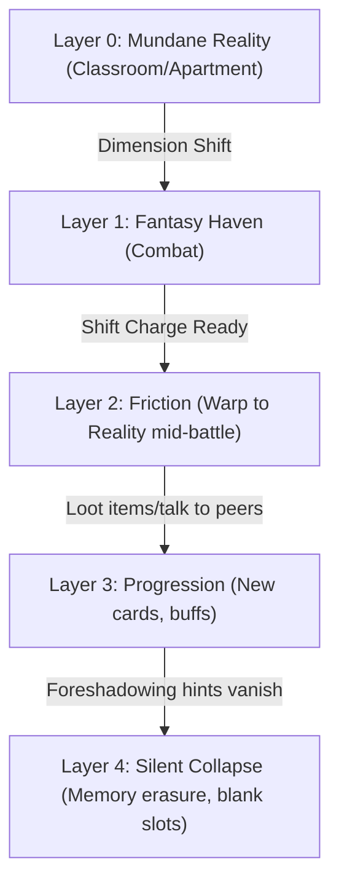

# Theoretical Story Structure and Narrative Progression

This document details the abstract design, logical layers, and progression mechanics of the narrative system for \"Before the Colours Fade\". It provides a theoretical framework for pacing mystery and utilizing trivial hints to foster player-led deduction.

## 1. Logical Layers of the Narrative Arc

The narrative does not follow a traditional hero's journey. Instead, it operates as a structured descent through cognitive layers:

### Layer 0: The Mundane Baseline
- **Focus:** Grounded reality.
- **Narrative State:** The player experiences a quiet, cold, and slow-paced grey world. The environment is filled with standard, everyday tasks (preparing for class, dealing with peers, dealing with messy drawers).
- **Function:** Establish normalcy. There are no dramatic declarations of grief. The absence of details (empty space, quietness) is the primary driver of atmosphere.

### Layer 1: The Delusional Haven
- **Focus:** The high-fantasy dream state.
- **Narrative State:** A colorful, vibrant, and high-stakes deckbuilder world. Actions are clear: attack, defend, defeat the boss. Hilbert feels capable and empowered.
- **Function:** Provide catharsis and mechanical rewards. The player is incentivized to stay in this layer because it is visually pleasing, active, and fun.

### Layer 2: The Cognitive Friction
- **Focus:** The boundary between dimensions.
- **Narrative State:** The crossover points where the fantasy world's rules begin to break down. The enemy intents are described in classroom terminology, or the combat requires shifting back to reality.
- **Function:** Introduce discrepancies. The player starts to notice that the anomalies in the fantasy world correspond directly to mundane stresses in the grey world.

### Layer 3: The Narrative Trade-Off
- **Focus:** Progression versus Erasure.
- **Narrative State:** The core progression loop. To progress through battles, the player must shift back to reality and inspect objects, which adds powerful cards to their deck. However, this process slowly strips away the subtle hints of the past.
- **Function:** Mechanical growth comes at the cost of narrative detail. The stronger the deck becomes, the more the grey world loses its specific history, replacing it with empty, dusty spaces.

### Layer 4: The Silent Collapse
- **Focus:** The resolution.
- **Narrative State:** The final state of the game. The player achieves the goal (surviving the day, passing the quiz), but the narrative details that connected Hilbert to his past are gone. The contact list is blank, the desk is empty, and only initials remain.
- **Function:** Subversion of victory. The player realizes that escaping the pain through mechanical progression resulted in the complete deletion of the source of that pain.

## 2. The Mechanics of the Trivial Hint

To keep the narrative engaging and avoid predictability, clues must be treated as minor, mundane details rather than heavy plot points:

### The Excused Anomaly
- Hilbert must always have a logical, mundane excuse for anything that is out of place. 
- If a face is scratched out in a photo, he assumes it is a tea smudge. If a guitar is tuned differently, he assumes he forgot how he left it.
- This prevents Hilbert from appearing self-aware of his memory loss, keeping the player in the same state of uncertainty.

### The Fragmented Margin
- Clues should be placed in marginalia (messy handwriting on blueprints, small scratches on desks, light flickers).
- By keeping the hints small, the player does not feel forced into a specific conclusion early. They treat them as background flavor until the pieces begin to connect.

### The Relatable Anchor
- All tension must remain anchored in simple, relatable conflicts (procrastination, social awkwardness, school anxiety). 
- Avoid using dramatic, high-energy emotional language. Relatability builds empathy, which makes the subsequent psychological horror of losing memory feel personal and unsettling.

## 3. Narrative Progression Model

By structuring the game around these theoretical layers, the narrative remains a puzzle for the player to assemble, ensuring that the climax delivers a genuine shock rather than a predictable resolution.
